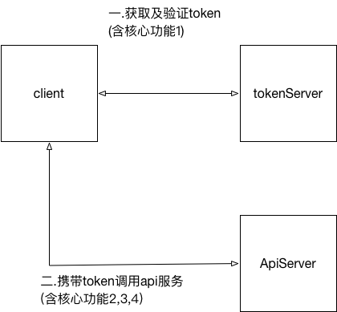

### wacai-openAllInOne-sdk是用来跟API网关交互的sdk

#### 依赖GAV
**依赖已经提交到 maven 中央仓库，直接使用即可**
```xml
<dependency>
   <groupId>com.wacai</groupId>
   <artifactId>wacai-openAllInOne-sdk</artifactId>
   <version>${version}</version>
</dependency>
```
如果想直接使用 jar 包，可以去[中央仓库](https://mvnrepository.com/artifact/com.wacai/wacai-openAllInOne-sdk)下载。

#### 交互图及对应核心功能


#### 核心功能
1.  ~~封装和授权系统的[交互逻辑](doc/api_auth.md)~~，高版本的 SDK 的不再使用 token，而是和 API 网关直连
2.  封装和API网关[协议及透传请求](doc/api_entry.md)实现细节
3.  封装参数[签名](doc/api_sign.md)逻辑
4.  被调用时的参数[请求签名校验](doc/request_sign.md)
5.  提供[token服务sdk](doc/token_api.md)
6.  封装接口序列化&反序列化 [定制序列化详情](doc/json_extend.md)


#### 核心依赖
- okhttp3 用于在http层面做通信
- slf4j-api 日志接口
- fastjson/jackson 用于序列化&反序列化
- commons-codes 签名字节数组的base64处理

#### 核心类和实现
- WacaiOpenApiClient 核心类，用于对API网关发起调用的Client
- WacaiOpenApiRequest API网关请求报文的封装类
- WacaiOpenApiResponse API网关响应报文的封装类

#### 代码案例

##### 构建Client和Request
```java

// WacaiOpenApiClient 是一个单例,不要在每次调用时候创建!!!
WacaiOpenApiClient wacaiOpenApiClient = new WacaiOpenApiClient("${appKey}", "${appSecret}");

// 如果是测试联调环境,需要添加如下一行代码,线上环境则不需要
// wacaiOpenApiClient.setGatewayEntryUrl("http://guard.ngrok.wacaiyun.com/gw/api_entry");

wacaiOpenApiClient.init();

WacaiOpenApiRequest wacaiOpenApiRequest = new WacaiOpenApiRequest("wacai.order.delete", "v2");
wacaiOpenApiRequest.putBizParam("card_id", "34121141242144");
wacaiOpenApiRequest.putBizParam("apply_money", 10);
```

##### 同步方式：
```java
OrderDeleteResponseObject wacaiOpenApiResponse = wacaiOpenApiClient.invoke(wacaiOpenApiRequest, new TypeReference<OrderDeleteResponseObject>() {});
```
**同步接口在异常返回时会抛出 WacaiOpenApiResponseException 异常，里边可以获取响应的错误码和详细的错误信息**

##### 异步方式：
```java
wacaiOpenApiClient.invoke(wacaiOpenApiRequest, new TypeReference<OrderDeleteResponseObject>() {}, new WacaiOpenApiResponseCallback<OrderDeleteResponseObject>() {
    @Override
    public void onSuccess(OrderDeleteResponseObject data){
        log.error("success {}", data);
    }

    @Override
    public void onFailure(WacaiOpenApiResponseException ex) {
        log.error("failure {}", ex);
    }
});
```
